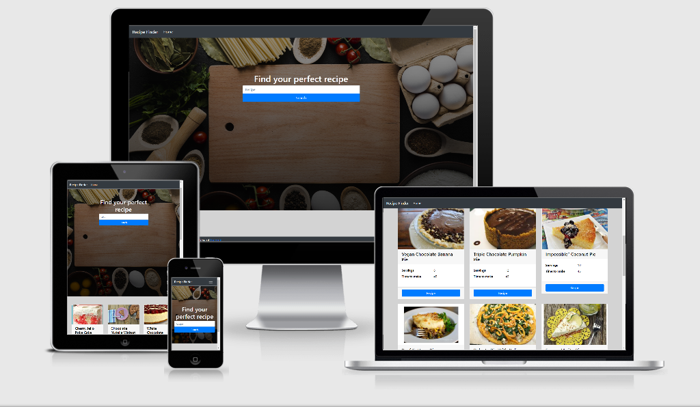
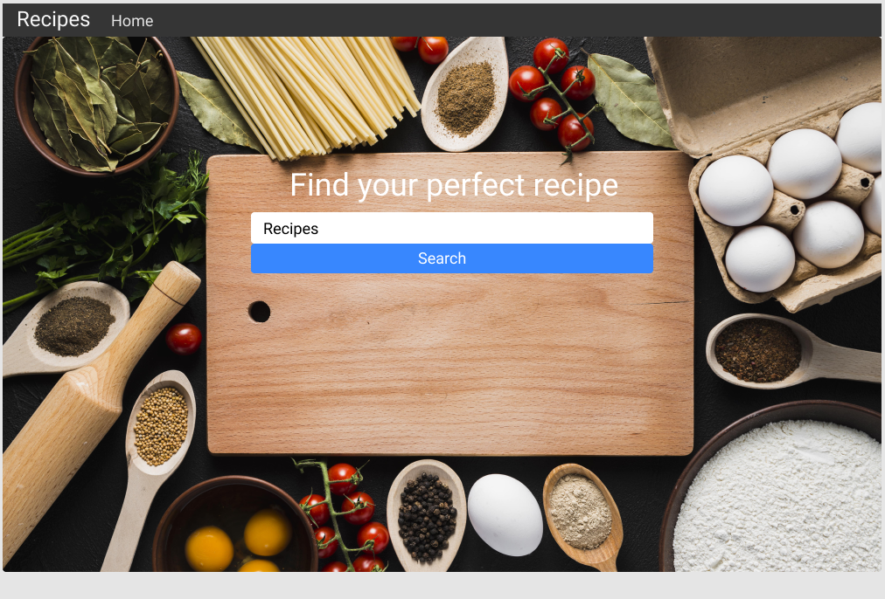

# My recipes

Milestone Project - 2 - rpi recipes

I have developed this page to provide a search based website. I have bulit this as a single page website that has an api search for any recipes.

The was designed to show a whole range of resipes show show any kind of meal or deserts that any one was looking to cook or bake.

Links below to my GitHub Pages and Github Repository:

- [Github Pages](https://jonathanuk84.github.io/Project-2-api-recipe/)

- [Github Repository](https://github.com/jonathanuk84/Project-2-api-recipe)

)

# UX
This website has been designed to act as an online recipes finder for people looking for specific meals or deserts. It has been created showing my skills 
in HTML, CSS and js so far.

# Wireframe

I desigined my site wireframe using Figma, please see link and screenshots below of my final draft. . 

[Figma - Click here to view my wireframe](https://www.figma.com/file/MQpvMBvXZ2Xhp8LNNiGMO6/Untitled?node-id=0%3A1)

My final product website has turned out exactly as planned with only 
a few little changes such as footer bar.:

1.  The top navbar is now fixed at the top to ensure ease of navigation from all points on the page.

2.  Boxes with pictures come up below main image showing recipes.

# User Stories
The main use for this site would be someone looking for recipes for something they want to bake or cook.

 # Users can see:

- An easy to navigate front page.

- A simple search bar.

- A huge list of what they are searching.

- A home button to return back to search page.

- Full recipes on what they are searching. 

# Features
- **Home** - A home button to return right back to the search menu.
at the first glance. 

- **search bar** - This section will search any recipe that is inputted. 

- **navbar** - on a mobile divice there is a nice and easy drop down that has the return to home button.
